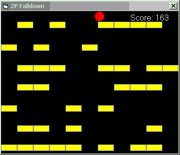



## \[ \*\*\*Falldown Game Clone\*\*\* \(update 2\)\]

### Description

A clone of the graphing calculator game Falldown, but much better, with special features. This is the best clone of the game on on PSC. Check it out. Includes a high score and different speeds. Uses one main loop, no timers. It might be slow if you have a lot of applications open. It took me a while, so DON'T FORGET TO VOTE AND COMMENT :)
 
### More Info
 
if the game is slow, try closing other running applications. (VB isn't made for games) :)

             |
---                |---
**Submitted On**   |2003-02-19 21:01:10
**By**             |[Tomas Tupy](https://github.com/Planet-Source-Code/PSCIndex/blob/master/ByAuthor/tomas-tupy.md)
**Level**          |Beginner
**User Rating**    |3.4 (17 globes from 5 users)
**Compatibility**  |VB 5\.0, VB 6\.0
**Category**       |[Games](https://github.com/Planet-Source-Code/PSCIndex/blob/master/ByCategory/games__1-38.md)
**World**          |[Visual Basic](https://github.com/Planet-Source-Code/PSCIndex/blob/master/ByWorld/visual-basic.md)
**Archive File**   |[\[\_\_\_\_Falld1547262202003\.zip](https://github.com/Planet-Source-Code/tomas-tupy-falldown-game-clone-update-2__1-43279/archive/master.zip)

